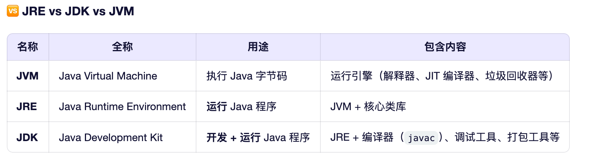

# Java基础知识

#### 计算机存储单位

- 位（bit 比特 -> b）0或者1

- 字节（byte ->B）8位为一字节

  > 1 KB=1024 Byte
  > 1 MB=1024 KB
  > 1 GB=1024 MB
  > 1 TB= 1024 GB
  > 1 PB= 1024 TB
  > 1 EB= 1024 PB
  > 1 ZB= 1024 EB 

#### JAVA语言开发环境  

#### 数据类型转换

> 由于 Java 是强类型语言，所以在进行有些运算的时候，需要用到类型转换。
> 低--------------------------------------------------->高
> byte，short，char->int->long->float->double（float，32位；高于long，64位；是因为小数优先级高于整数）
> 运算中，不同类型的数据先转换为同一类型，然后进行运算。
> 转换类型分为强制转换和自动转换。
>


#### 变量作用域

实例变量 vs 其他变量对比

| 变量类型               | 声明位置                  | 是否有默认值     | 生命周期     | 访问方式                             |
| ---------------------- | ------------------------- | ---------------- | ------------ | ------------------------------------ |
| **实例变量**           | 类中，方法外，无 `static` | ✅ 有默认值       | 随对象存在   | 通过对象访问（`obj.name`）           |
| **类变量**（静态变量） | 类中，方法外，有 `static` | ✅ 有默认值       | 随类加载存在 | 通过类名或对象访问（`Hello.salary`） |
| **局部变量**           | 方法/代码块内部           | ❌ 必须手动初始化 | 方法调用期间 | 直接使用（`int i = 8;`）             |

#### 常量

初始化后不能改变值，用finally修饰

```java
// final 常量名 = 值;
final double PI = 3.14;//变量名一般为大写
static final double PI=3.14;//3.14
static double final PI=3.14;//3.14数据类型前面的关键字均为修饰符不存在先后顺序
```


#### 变量的命名规范

```java
1.类里面的变量和方法都是使用小驼峰命名
2.类使用大驼峰命名
3.常量使用全大写+"_"命名
```


#### 包机制

一般利用公司域名倒置作为包名（com.baidu.www）